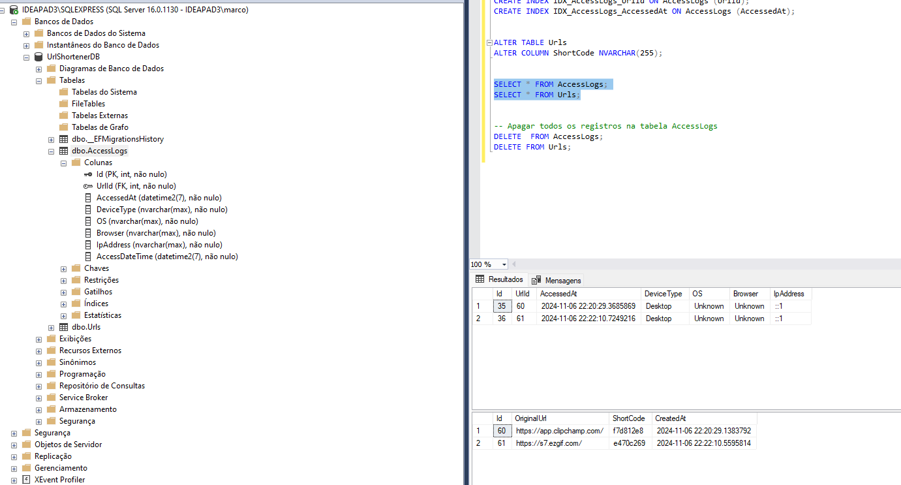
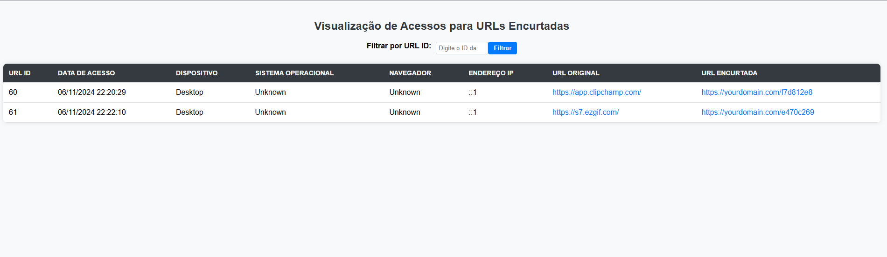

# UrlShortenerService

Um serviço de encurtamento de URL desenvolvido com .NET 7 e SQL Server. Este projeto permite criar URLs curtas de forma eficiente e segura, registrar acessos com detalhes sobre o dispositivo e sistema do usuário, e fornecer uma interface para visualizar os logs de acesso.

## Visão Geral

Este projeto foi desenvolvido como parte de um teste de desenvolvedor, com o objetivo de demonstrar habilidades em .NET, autenticação básica e integração com banco de dados SQL Server. O serviço inclui autenticação, coleta de dados do dispositivo e fornece uma interface básica para visualizar logs de acessos.

### Funcionalidades

- **Encurtamento de URL**: Gera URLs curtas e únicas para URLs longas.
- **Redirecionamento**: Redireciona o usuário ao acessar a URL curta.
- **Registro de Acessos**: Registra informações de cada acesso, incluindo dispositivo, sistema operacional, navegador, IP e data/hora.
- **Autenticação Básica**: Protege endpoints sensíveis usando autenticação básica.
- **Interface de Visualização**: Interface simples para visualizar os acessos registrados, com filtros e ordenação.

### Screenshots e Demonstração

### DB



#### Interface de Visualização



> Demonstração do funcionamento do sistema:


## Pré-requisitos

Antes de começar, você precisará ter as seguintes ferramentas instaladas:

- [.NET SDK 7](https://dotnet.microsoft.com/download/dotnet/7.0)
- [SQL Server](https://www.microsoft.com/pt-br/sql-server/sql-server-downloads) (ou SQL Server Express)
- [Visual Studio 2022](https://visualstudio.microsoft.com/) (recomendado para configuração e execução)

## Configuração e Instalação

### Passo 1: Clonar o Repositório

Clone este repositório para sua máquina local usando o seguinte comando:

```bash
git clone https://github.com/seu-usuario/UrlShortenerService.git
cd UrlShortenerService
```

### Passo 2: Configuração do Banco de Dados

1. Abra o **SQL Server Management Studio (SSMS)** e crie um novo banco de dados chamado `UrlShortenerDB` ou o nome de sua preferência.
2. No arquivo `appsettings.json` (localizado na raiz do projeto), configure a string de conexão com o banco de dados:

   ```json
   "ConnectionStrings": {
       "DefaultConnection": "Server=localhost\SQLEXPRESS;Database=UrlShortenerDB;Trusted_Connection=True;"
   }
   ```

   > Ajuste `Server` e `Database` de acordo com sua configuração local.

### Passo 3: Configuração da Autenticação

Este projeto utiliza autenticação básica. As credenciais padrão são:

- **Usuário**: `admin`
- **Senha**: `password`

Essas credenciais são configuradas no `BasicAuthenticationHandler` e podem ser alteradas diretamente no código.

### Passo 4: Executar as Migrações de Banco de Dados

No Visual Studio, abra o Console do Gerenciador de Pacotes (ou via CLI do .NET) e execute o seguinte comando para criar as tabelas necessárias no banco de dados:

```bash
Update-Database
```

Isso aplicará as migrações e criará as tabelas necessárias (`Urls` e `AccessLogs`).

### Passo 5: Executar o Projeto

Agora, você pode rodar o projeto. No Visual Studio, clique em **Iniciar Depuração** ou execute o comando abaixo:

```bash
dotnet run
```

O serviço estará disponível em [https://localhost:7017](https://localhost:7017).

## Endpoints

### 1. Encurtamento de URL
- **Método**: `POST`
- **URL**: `/api/url/encurtar`
- **Corpo da Requisição**:

  ```json
  {
      "originalUrl": "https://sua-url-longa.com"
  }
  ```

- **Autenticação**: Basic Auth (`admin:password`)

### 2. Redirecionamento de URL
- **Método**: `GET`
- **URL**: `/api/url/{shortCode}`

- Redireciona para a URL original e registra os dados de acesso.

### 3. Visualização de Acessos
- **URL da Interface**: `/AccessLog`
- Exibe uma lista dos acessos registrados para cada URL encurtada, incluindo data, dispositivo, navegador, sistema operacional e IP.

## Estrutura do Projeto

- **Controllers**: Contém os controladores da API, incluindo o controlador para logs de acesso (`AccessLogController`) e o controlador de URL (`UrlController`).
- **Models**: Define as classes de modelo `Url` e `AccessLog`, usadas para representar dados no banco de dados.
- **Services**: Contém `UrlService`, responsável pela lógica de encurtamento e redirecionamento.
- **Authentication**: Contém o `BasicAuthenticationHandler` para autenticação básica.
- **Data**: Contém o contexto de dados (`AppDbContext`), que gerencia a conexão com o banco de dados.

## Modificações Recentes

- **Autenticação Básica**: Implementação da autenticação básica com `BasicAuthenticationHandler`.
- **Tratamento de Referências Nulas**: Adicionadas verificações para evitar erros de referência nula ao manipular os headers de autorização.
- **TimeProvider**: Substituição do `ISystemClock` por `TimeProvider`, devido à depreciação.
- **Inicialização de Propriedades Não Anuláveis**: Adicionados valores padrão para propriedades não anuláveis no modelo `AccessLog`, eliminando avisos do compilador.

## Contribuição

Sinta-se à vontade para contribuir com melhorias para este projeto. Para contribuir:

1. Fork este repositório.
2. Crie uma nova branch (`git checkout -b feature/nova-feature`).
3. Faça suas alterações e faça commit (`git commit -m 'Adiciona nova feature'`).
4. Envie para a branch (`git push origin feature/nova-feature`).
5. Abra um Pull Request.

## Licença

Este projeto está sob a licença MIT. Consulte o arquivo [LICENSE](LICENSE) para mais informações.

---
